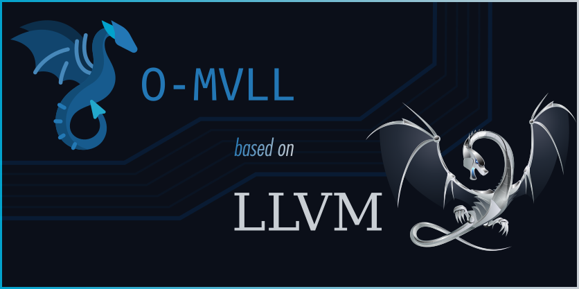
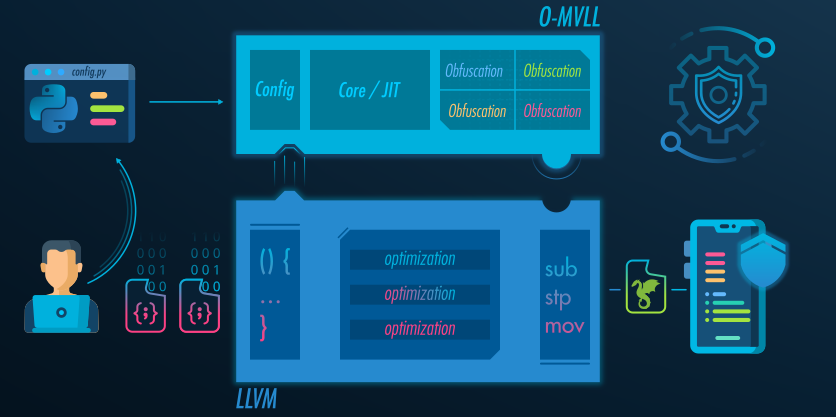

<p align="center">
  <br />
  <br />
  <a href="https://obfuscator.re/omvll">
    
  </a>
  <br />
  <br />
  <a href="https://build38.com/">
    
  </a>
</p>

<p align="center">
  <a href="LICENSE">
    
  </a>
  &nbsp;
  <a href="https://github.com/open-obfuscator/o-mvll/actions/workflows/ndk.yml">
    
  </a>
  &nbsp;
  <a href="https://github.com/open-obfuscator/o-mvll/actions/workflows/xcode.yml">
    
  </a>
</p>

# O-MVLL

O-MVLL (in reference to [O-LLVM](https://github.com/obfuscator-llvm/obfuscator)) is a LLVM-based obfuscator
driven by Python and the LLVM pass manager. It can be run as follows:

```bash
clang++ -fpass-plugin=libOMVLL.dylib main.cpp -o main
```

```python
import omvll

class MyConfig(omvll.ObfuscationConfig):
    def __init__(self):
        super().__init__()

    def flatten_cfg(self, mod: omvll.Module, func: omvll.Function):
        if func.name == "check_password":
            return True
        return False
```



O-MVLL can be used with the Android NDK and an iOS toolchain. It currently supports AArch64 and ARM architectures.

For more details, please check out the documentation at [obfuscator.re/omvll](https://obfuscator.re/omvll).

### Download

- [Official releases](https://github.com/open-obfuscator/o-mvll/releases)
- [Experimental builds](https://open-obfuscator.build38.io/ci/index.html)

### Contact

Feel free to reach out at `ping@obfuscator.re` for any doubt, issue, bug you may encounter.

#### Maintainers

- [Build38: The Next-Gen Mobile App Security Platform](https://build38.com/)

#### Author

- [Romain Thomas](https://www.romainthomas.fr): [@rh0main](https://twitter.com/rh0main) (`me@romainthomas.fr`)

#### Credits

- [LLVM](https://llvm.org/)
- [obfuscator-llvm](https://github.com/obfuscator-llvm/obfuscator)
- [obfuscator-llvm](https://github.com/eshard/obfuscator-llvm) from [eShard](https://eshard.com/)
- [Hikari](https://github.com/HikariObfuscator/Hikari)
- [DragonFFI](https://github.com/aguinet/dragonffi)

### License

O-MVLL is released under the same License as LLVM: [Apache License, Version 2.0](./LICENSE).

This project is partly funded by the EU and the European Cybersecurity Competence Center.

<div style="display: flex; gap: 0px; padding: 10px;">
    
    
</div>
